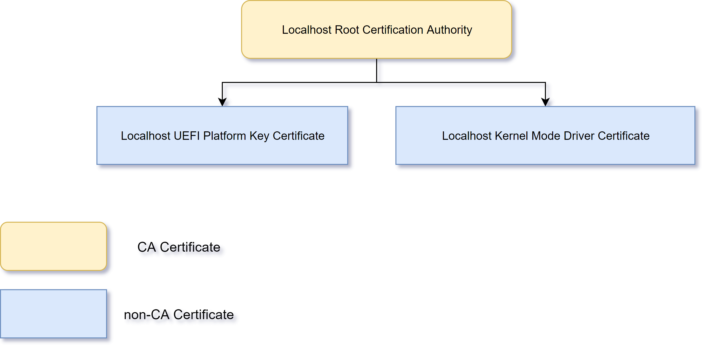

# Create certificates

This section will create certificates whose relationship looks like the following picture. __Please DO NOT CLOSE Powershell while reading this section.__



## 1. Create A Root CA Certificate

A root CA certificate is the root of trust. Once a root CA certificate is trusted, all certificates issued by the root CA certificate will be trusted as well, except those certificates in CA's CRL. But, so far, we don't need to care about CRL.

Run Powershell as administrator:

```powershell
$cert_params = @{
    Type = 'Custom'
    Subject = 'CN=Localhost Root Certification Authority'
    FriendlyName = 'Localhost Root Certification Authority'
    TextExtension = '2.5.29.19={text}CA=1'
    HashAlgorithm = 'sha512'
    KeyLength = 4096
    KeyAlgorithm = 'RSA'
    KeyUsage = 'CertSign','CRLSign'
    KeyExportPolicy = 'Exportable'
    NotAfter = (Get-Date).AddYears(100)
    CertStoreLocation = 'Cert:\LocalMachine\My'
}

$root_cert = New-SelfSignedCertificate @cert_params
```

where 

1. `TextExtension`

   * `2.5.29.19` is the OID that represents `Basic Constraints`.

   * `CA=1` indicates that new certificate is a CA certificate.

   * Of cource, you can add `&pathlength=x` following `CA=1` where `x` represents the number of intermediate CA certificates that may follow in a valid certification path. 

     For example, if you add `&pathlength=2`, it means a valid certification path could only at most as long as

     ```
     [+] "Localhost Root Certification Authority"
      |- [+] "Intermediate CA 1"
          |- [+] "Intermediate CA 2"
     ```

     If there's `Intermediate CA 3` issued by `Intermediate CA 2`, it will not be trusted. Of cource, `Intermediate CA 2` can still issue non-CA certificates.

     If `pathlength` is not specified, there's no length-limit for a valid certification path.

After the two commands, you can open `certlm.msc` and see newly-generated certificates in `Personal\Certificates` with private key and in `Intermediate Certification Authority\Certificates` without private key. 

You can move the latter certificate to `Trusted Root Certification Authority\Certificates` area to trust it.

## 2. Create Kernel Mode Code-Sign Certificate

We use the newly-generated root CA certificate to issue a non-CA certificate that will be used to sign all kernel mode drivers.

```powershell
$cert_params = @{
    Type = 'CodeSigningCert'
    Subject = 'CN=Localhost Kernel Mode Driver Certificate'
    FriendlyName = 'Localhost Kernel Mode Driver Certificate'
    TextExtension = '2.5.29.19={text}CA=0'
    Signer = $root_cert
    HashAlgorithm = 'sha256'
    KeyLength = 2048
    KeyAlgorithm = 'RSA'
    KeyUsage = 'DigitalSignature'
    KeyExportPolicy = 'Exportable'
    NotAfter = (Get-Date).AddYears(10)
    CertStoreLocation = 'Cert:\LocalMachine\My'
}

$km_cert = New-SelfSignedCertificate @cert_params
```

After the two commands, you can open `certlm.msc` and see newly-generated certificate in `Personal\Certificates` with private key.

## 3. Create UEFI Platform Key Certificate

We use the newly-generated root CA certificate to issue a non-CA certificate that will be used as UEFI Platform Key.

```powershell
$cert_params = @{
    Type = 'Custom'
    Subject = 'CN=Localhost UEFI Platform Key Certificate'
    FriendlyName = 'Localhost UEFI Platform Key Certificate'
    TextExtension = '2.5.29.19={text}CA=0'
    Signer = $root_cert
    HashAlgorithm = 'sha256'
    KeyLength = 2048
    KeyAlgorithm = 'RSA'
    KeyUsage = 'DigitalSignature'
    KeyExportPolicy = 'Exportable'
    NotAfter = (Get-Date).AddYears(10)
    CertStoreLocation = 'Cert:\LocalMachine\My'
}

$pk_cert = New-SelfSignedCertificate @cert_params
```

Again, you can open `certlm.msc` and see newly-generated certificate in `Personal\Certificates` with private key.

## 4. Export certificates

Export three certificates we just generated in `Personal\Certificates` of `certlm.msc` to following files

```
// self-signed root CA certificate
localhost-root-ca.der
localhost-root-ca.pfx

// kernel mode certificate issued by self-signed root CA
localhost-km.der
localhost-km.pfx

// UEFI Platform Key certificate issued by self-signed root CA
localhost-pk.der
localhost-pk.pfx
```

Note that `*.der` are DER-encoded certificate files without private key. And `*.pfx` are certificate files with private key.

